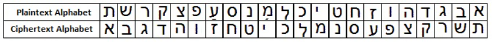
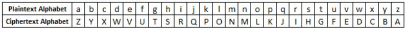

<html>
  <head>
    <title>Title of the document</title>
    
  </head>
  <body>
    

      <button class="button" data-modal="modalOne">How to Encrypt Atbash</button>
    

    

      <button class="button" data-modal="modalTwo">How to Decrypt Atbash</button>
    

    

      <button class="button" data-modal="modalThree">Atbash Sample Problem</button>
    

    

      

        

          <a class="close">&times;</a>
          <form action="/">
            <h2>How to Encrypt Atbash</h2>
            

            The Atbash Cipher simply reverses the plaintext alphabet to create the ciphertext alphabet. That is, the first letter of the alphabet is encrypted to the last letter of the alphabet, the second letter to the penultimate letter and so forth. In the original Hebrew this means that 'aleph' is encrypted to 'tav', and 'beth' to 'shin'. This is where we get the name of the cipher 'atbash'. For the Hebrew alphabet we get the following conversion table.
            

            
            

            For the Roman alphabet of 26 letters, we have the ciphertext alphabet as given in the table below.
            

            
            

            As with any monoalphabetic substitution cipher, encryption using the Atbash Cipher is very simple once the ciphertext alphabet has been generated. We simply replace each occurence of each plaintext letter with the respective ciphertext letter given by the table. So, if we take the plaintext "atbash", we can see that "a" enciphers to "Z", "t" enciphers to "G" and so on. Continuing in this way, we see that the final ciphertext is "ZGYZHS".
            
 
          </form>
        

      

    

    

      

        

          &times;
          <form action="/">
            <h2>How to Decrypt Vigenere</h2>
            
Due to the symmetric nature of this cipher, the decryption process is exactly the same as the encryption process. Thus, for the recipient to decrypt the ciphertext, the same ciphertext alphabet must be generated as was used to encrypt the message in the first place. In this case, the ciphertext alphabet relies only on the alphabet used, and hence the table above is also used to decipher the message. So, given the ciphertext "XRKSVI", and assuming that the alphabet used was the standard Roman alphabet of 26 letters, we can retrieve the plaintext "cipher".

          </form>
        

      

    

    

      

        

          &times;
          <form action="/">
            <h2>Vigenere Sample Problem</h2>
            

  <h2 style="color: black;">Encrypt the sample text FLEE AT ONCE!</h2> 
  
Choose the best answer:
 
  

  

    <label for='option-11' style=' padding: 5px; font-size: 1.5rem; color: black;'>
      <input type='radio' name='option' value='UOVV ZG LMXV' id='option-11' style='transform: scale(1.6); margin-top: -2px;' />
      .   UOVV ZG LMXV</label>
    
  

  

  

    <label for='option-12' style=' padding: 5px; font-size: 1.5rem; color: black;'>
      <input type='radio' name='option' value='UODD ZG LMXD' id='option-12' style='transform: scale(1.6); margin-top: -2px;' />
      .   UODD ZG LMXD</label>
    
  

  

  

    <label for='option-13' style=' padding: 5px; font-size: 1.5rem; color: black;'>
      <input type='radio' name='option' value='USVV ZG LMSV' id='option-13' style='transform: scale(1.6);  margin-top: -2px;' />
      .   USVV ZG LMSV</label>
    
  

  

  

    <label for='option-14' style=' padding: 5px; font-size: 1.5rem; color: black;'>
      <input type='radio' name='option' value='WOVV ZG LMXV' id='option-14' style='transform: scale(1.6); margin-top: -2px;' />
      .   WOVV ZG LMXV</label>
    
  

  

  <button type='button' onclick='displayAnswer1()' style='width: 100px; height: 40px; border-radius: 3px; background-color: lightblue; font-weight: 700;'>Submit</button>

          </form>
        

      

    

    
  </body>
</html>